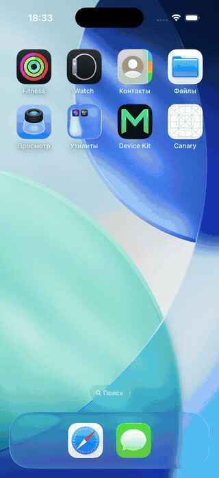
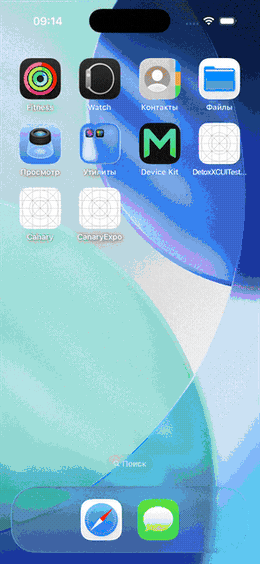

<div align="center">


# SymbioteNative

### Want to ship a real native iOS/Android app, but you don't write React? Today you can't.

**Beta** · iOS + Android · React + Vue + Angular + Svelte + Solid · one native core, N framework adapters

[**Docs**](https://docs.symbiote-native.dev) · [Why SymbioteNative](#why-not-nativescript-lynx-or-just-react-native) · [Architecture](#how-it-works) · [Testing](#testing) · [Milestones](#milestones) · [React adapter](./adapters/react) · [Vue adapter](./adapters/vue) · [Angular adapter](./adapters/angular) · [Svelte adapter](./adapters/svelte) · [Solid adapter](./adapters/solid)

</div>

---

## The Problem

React Native gives you a genuinely good native stack — Fabric's C++ shadow tree, Yoga
layout, JSI, the iOS/Android host, Hermes. But that whole stack only takes orders from
**React**. Write your UI in Vue, Svelte, Solid, or Angular and your options collapse to
a WebView or a rewrite. The native rendering engine is right there, and every framework
except one is locked out of it.

It doesn't have to be. React is **not** privileged inside React Native's renderer. Fabric
exposes a framework-agnostic, JSI-bound mutation API — `global.nativeFabricUIManager` —
and React's renderer is just _one client_ of it. All of React's glue lives in a single
file (`ReactFiberConfigFabric.js`). "Removing React" means: stop calling that file, call
the slot from your own renderer instead. **The native core is never touched.**

SymbioteNative turns React Native's **internals** — Fabric's C++ shadow tree, Yoga layout,
Hermes, JSI — into a **universal native rendering layer**. It extracts that engine, puts a
tiny seam in front of it, and lets **any** UI framework drive real native views through it.
The rendering layer is React Native's; React the framework is just one client. One native
core, N thin adapters.

> The shape is a shared retained tree plus a thin per-framework reconciler — the same pattern
> that already drives a terminal layout engine across five UI frameworks, retargeted here from
> ANSI terminal output to native iOS/Android views.

---

## Why Not NativeScript, Lynx, or Just React Native?

Every existing answer to "native UI without React lock-in" forces a trade this project
doesn't. The demand is real - Tencent's Hippy and ByteDance's Lynx both ship multi-framework
native UI at real production scale - but each option gives up something structural:

|                      | Native layer                                                                                                | Frameworks                                                                                                                                                                                                             | Native-module ecosystem                                               | The trade you make                                                                           |
| -------------------- | ----------------------------------------------------------------------------------------------------------- | ---------------------------------------------------------------------------------------------------------------------------------------------------------------------------------------------------------------------- | --------------------------------------------------------------------- | -------------------------------------------------------------------------------------------- |
| **React Native**     | Fabric / Yoga / Hermes, the most battle-tested stack, maintained by Meta                                    | React only                                                                                                                                                                                                             | Thousands of packages: payments, maps, analytics are an `npm install` | React lock-in                                                                                |
| **NativeScript**     | Its own runtime + bindings, maintained by nstudio (core last commit Aug 14, 2026, releases every 2-4 weeks) | Angular active (`@nativescript/angular` 21.0.0, Jan 2026); Vue quiet since `3.0.2` in Oct 2025; Svelte's community fork stalled since Dec 2025, and the original `svelte-native` package hasn't shipped since Nov 2024 | Its own, real but a fraction of RN's                                  | Leave RN's ecosystem, and framework support quality varies sharply by which one you pick     |
| **Hippy** (Tencent)  | Its own C++ DOM + its own Flex layout engine, maintained by Tencent                                         | React and Vue, both officially supported, shipping in QQ, QQ Music, and Tencent News (releases through Aug 2025)                                                                                                       | Its own, real production scale but a separate ecosystem from RN's     | Leave RN's ecosystem for Tencent's, solid Vue support but on their roadmap                   |
| **Lynx** (ByteDance) | Its own new engine (PrimJS, dual-thread), launched March 2025                                               | ReactLynx is the only framework that actually ships; Vue support is an unfinished community prototype                                                                                                                  | Minimal, most integrations mean hand-written native bridging          | A year-old ecosystem, and "framework-agnostic" is still a roadmap item, not what ships today |
| **SymbioteNative**   | **Stock, unforked React Native**, Meta keeps maintaining it, you keep upstream merges                       | React, Vue 3, Angular, Svelte, Solid all shipping today                                                                                                                                                                | RN's own, inherited at the native-view level                          | Beta, also there is no `create-symbiote` scaffolder **yet**                                  |

NativeScript and Hippy each prove multi-framework native UI works at real scale, carrying
their own native runtime alone. Lynx, a year into its own new engine, still ships React
only. SymbioteNative is, as far as we've verified, the only one of these reusing React
Native's own unforked Fabric/JSI/Yoga pipeline as the shared native backend - everyone
else wrote their native layer from scratch. Different bet, not automatically a bigger
one: it buys Meta's maintenance and the existing RN ecosystem, at the cost of staying
inside what Fabric can already do. And because the native core is never forked, every
tool that hooks RN's internals - Detox, the debugger, native modules - works unchanged
across every adapter (see [Testing](#testing)).

One honest caveat: a third-party RN package's _JS component_ is React-only by nature (it
calls hooks internally), so non-React adapters reach third-party _native views_ through
thin wrappers like [`@symbiote-native/slider`](./packages/slider) — the native view is
framework-agnostic, the React wrapper around it is not.

---

## How It Works

```
Vue · Svelte · Solid · Angular · React     thin reconciler / createRenderer per framework
        │  insert / remove / setProp / commit
        ▼
@symbiote-native/engine : retained shadow-tree + diff→childSet + event normalization
        │  ALL clone-on-write lives HERE, in one place
        ▼
nativeFabricUIManager   createNode · cloneNodeWithNewProps · appendChildToSet · completeRoot
        ▼
stock react-native : Fabric C++ · JSI · Yoga · RCTFabricSurface       ← never forked
```

The hard part is that Vue/Svelte/Solid/Angular **mutate** nodes in place
(`el.setAttribute`), while Fabric is **persistent** — every change clones the node with
new props and atomically commits a new child set. That mutation→clone-on-write translation
lives **once**, in `@symbiote-native/engine` — adapters see only a four-call mutation API, and
a persistence bug is fixed once, for every framework.

<details>
<summary><b>Details</b> — data flow, events, bootstrap, what stays stock</summary>

**One update.** Framework reactivity fires → the adapter calls `engine.setProp / insert /
remove` on a retained node → the engine marks it dirty → on flush, the engine walks the dirty path,
clones changed nodes with new props, builds a new childSet, and calls
`completeRoot(rootTag, childSet)` → Fabric C++ diffs old vs new shadow tree → native views
update.

**Events fall out of the seam — they are not a separate subsystem.** At `createNode` time
the adapter passes an `instanceHandle`; Fabric hands that same handle back when an event
fires. In React it's the fiber; in SymbioteNative it's the retained-tree node. The engine normalizes
the raw native event onto a listener registered on the node, and the adapter maps its own
template syntax (`@click`, `on:click`, `(click)`) onto that listener. No new layer.

**Bootstrap.** The native host raises a Fabric surface (`RCTFabricSurface` on iOS) via stock
RN's `AppRegistry`, which mints a `rootTag`. SymbioteNative's entry registers a _runnable_ (not a
component): instead of mounting React's app, it hands the `rootTag` to `mount(...)` and commits
the initial child set.

**What stays stock RN.** Fabric C++, JSI, Yoga, the iOS/Android host, `RCTFabricSurface`,
native modules. None of it is forked or patched — `react-native` is an ordinary dependency.
The only thing SymbioteNative replaces is the JS renderer.

</details>

---

## See It Work

The _same_ native app — same `@symbiote-native/engine`, same stock Fabric core — driven by five different
frameworks on the iOS simulator. React Native's own renderer is never in the path of any of them:

<div align="center">

<table>
<tr>
<td align="center"><b>React</b></td>
<td align="center"><b>Vue 3</b></td>
<td align="center"><b>Angular</b></td>
<td align="center"><b>Svelte</b></td>
<td align="center"><b>Solid</b></td>
</tr>
<tr>
<td></td>
<td></td>
<td></td>
<td></td>
<td></td>
</tr>
</table>

</div>

The smallest slice is a tap→increment counter. The app is ordinary React (or Vue) — it just
imports primitives from `@symbiote-native/*` instead of `react-native`:

```jsx
import { useState } from 'react';
import { View, Text, Pressable } from '@symbiote-native/react';

export default function App() {
  const [count, setCount] = useState(0);
  return (
    <View style={{ padding: 24 }}>
      <Text>Taps: {count}</Text>
      <Pressable onPress={() => setCount(c => c + 1)}>
        <Text>Tap me</Text>
      </Pressable>
    </View>
  );
}
```

That tree paints real native views, and the tap re-commits through `@symbiote-native/engine` into Fabric.
The entry seam (a low-level _runnable_, not a component), the full canary, and how to run each one
live in the per-adapter READMEs:

- **[`adapters/react`](./adapters/react)** — `@symbiote-native/react`, the reference adapter (full RN surface, iOS + Android).
- **[`adapters/vue`](./adapters/vue)** — `@symbiote-native/vue`, Vue 3 on the same core (`examples/vue-tsx`, `examples/vue-sfc`).
- **[`adapters/angular`](./adapters/angular)** — `@symbiote-native/angular`, `Renderer2`/`RendererFactory2` on the same core (`examples/angular`).
- **[`adapters/svelte`](./adapters/svelte)** — `@symbiote-native/svelte`, a DOM shim over stock compiled Svelte output on the same core (`examples/svelte`).
- **[`adapters/solid`](./adapters/solid)** — `@symbiote-native/solid`, `solid-js/universal`'s `createRenderer` on the same core (`examples/solid`).

---

## Try It In Your Own App

Full guides, per-framework setup, and package API references live at
**[docs.symbiote-native.dev](https://docs.symbiote-native.dev)**.

Every adapter is [published to npm](https://www.npmjs.com/org/symbiote-native) at `0.1.x`. Pick your framework and add it to an existing React Native app:

```bash
# React
npm install @symbiote-native/react react-native react

# Vue 3
npm install @symbiote-native/vue react-native vue

# Angular (>=20, for stable zoneless change detection)
npm install @symbiote-native/angular react-native @angular/core

# Svelte
npm install @symbiote-native/svelte react-native svelte

# Solid
npm install @symbiote-native/solid react-native solid-js
```

`react-native` (and `react`/`vue`/`@angular/core`/`svelte`/`solid-js`) stay **your app's own top-level dependencies** —
SymbioteNative never hides them, it only replaces the JS renderer that drives them. There's no
`create-symbiote` scaffolder yet, so the Metro config and the `index.js` entry seam
(`registerRunnable`, not `registerComponent`) aren't generated for you — copy them from the matching
example app, per the adapter's own README:

- **[`adapters/react`](./adapters/react)** — plain Metro, no extra build step.
- **[`adapters/vue`](./adapters/vue)** — TSX needs nothing extra; SFC adds a Metro transformer for `.vue` files.
- **[`adapters/angular`](./adapters/angular)** — needs `ngc --watch` running alongside Metro (AOT compiles separately from Metro).
- **[`adapters/svelte`](./adapters/svelte)** — adds a Metro transformer for `.svelte` files, same recipe as Vue SFC.
- **[`adapters/solid`](./adapters/solid)** — needs `@symbiote-native/solid/babel-preset` listed last in Metro's Babel presets, so it claims the JSX before the RN preset's own React-JSX transform does.

The navigation package ([`@symbiote-native/navigation`](./packages/navigation) — a native
stack/tab/drawer navigator over `react-native-screens`), the third-party-view wrapper
([`@symbiote-native/slider`](./packages/slider)), and the Android host-shim package
([`@symbiote-native/android`](./packages/android)) are also on npm, installed the same way.

---

## Status

> [!NOTE]
> **Beta, but the API is settled.** The thesis is proven _five times over_: React Native's
> renderer is extracted, and **five** frameworks — React, Vue 3, Angular, Svelte, and Solid — drive
> the same untouched framework-agnostic core on iOS + Android, with RN's own renderer never in the path.
> Every adapter (and the shared core packages under it) ships to npm at `0.1.x`, so you can add one
> to an existing RN app today — see [Try It In Your Own App](#try-it-in-your-own-app). All five run
> on device and are on the landing-page switcher, in day-to-day use. What's still catching up: the long-tail prop surface keeps widening, automated
> device coverage is just coming online, and the `create-symbiote` scaffolder doesn't exist yet, so wiring Metro/CocoaPods follows
> the example apps rather than one command. iOS stays the reference surface; Android is at canary
> parity.

**Proven on device, both platforms, RN's renderer never in the path:** every primitive
(`View` / `Text` / `Image` / `ScrollView` / `TextInput` / `Pressable` / `Switch` / `Modal` / the
`VirtualizedList` family / …), the runtime-module layer (`Platform` / `StyleSheet` / `Dimensions` /
`Alert` / `Share` / …), `Animated` on **both** the JS and native drivers, the gesture/responder
lifecycle, accessibility, and RN's JS style processors — all committing through `@symbiote-native/engine`
into Fabric. Each adapter's full surface and what's verified where lives in its README:
[**React →**](./adapters/react) · [**Vue →**](./adapters/vue) · [**Angular →**](./adapters/angular) ·
[**Svelte →**](./adapters/svelte) · [**Solid →**](./adapters/solid).

**The bar for "done" is the canary, not a percentage.** The example apps are the working spec —
they exercise the real surface and run green on an iOS simulator and an Android emulator. RN's own
surface is effectively unbounded; rather than chase a parity figure, the canary defines the
contract and stays green. **In progress:** widening the long-tail prop surface and bringing Android
fully level with the iOS reference.

---

## Testing

SymbioteNative never forks the native core, so a SymbioteNative app **is** a stock React Native app underneath.
That has a quiet payoff: **any tool that hooks RN's internals works on SymbioteNative unchanged — for every
adapter, for free.** We didn't build a test framework; we inherited RN's. The same lever that lets a
non-React renderer drive Fabric lets RN's testing, debugging, and native-module ecosystem come along
without per-framework reinvention.

- **Headless — Vitest + `node:test`.** Colocated TypeScript unit + smoke tests drive the engine
  against a fake `nativeFabricUIManager` slot (`installFabric`) and read committed Fabric props
  back — the real commit path, no simulator, mirroring RN's own Fantom approach. Native ESM/CJS
  tooling tests (the publish-output rewriter and app linker) run through Node's built-in runner.
  `pnpm test` at the workspace root runs both layers; `pnpm test:vitest` and `pnpm test:node` narrow
  one layer while developing.
- **On-device — `Detox`.** End-to-end user-journey tests run against the real app on a
  simulator/emulator. One `canary-journeys` spec is mirrored across `examples/react`,
  `examples/vue-tsx`, `examples/vue-sfc`, and `examples/svelte` — the _same_ journeys, proving each
  adapter paints and responds identically on device. `examples/angular` has its own Detox harness
  but not this shared spec yet; `examples/solid` has no Detox harness yet.
  Detox attaches with zero SymbioteNative-specific glue, because to Detox
  it is just an RN app (`e2e:build:ios` / `e2e:test:ios`, and the `android` equivalents).

The lever is the same as the renderer's: stay on RN's internals, and the whole RN ecosystem —
testing, debugging, native modules — is yours across every framework. Per-adapter commands live in
each adapter's README.

---

## Milestones

Make **React** the known-good driver first — cover its RN surface on the agnostic core, canary as
spec — then add one framework at a time on an already-validated core, so a break in a new adapter
isolates to _that adapter_, not the native pipe or the commit engine. The **framework** axis
(React → Vue → Angular → Svelte → Solid) and the **platform** axis (iOS, Android) are independent:
React already drives both platforms, and each new adapter inherits the platform axis as it lands.

Five frameworks now drive the core (React, Vue, Angular, Svelte, Solid) — the _breadth_ bet is
proven. What they still lack is _depth_: a real app needs more than primitives and a canary,
starting with navigation. That's why **M5 keeps running alongside adapter work** — porting the
minimal third-party-library surface a real app can't ship without is as urgent a proof as a new
framework adapter.

| #      | Milestone                                        | What it proves                                                                                                                                                                                                                                                                                                                                        | Status     |
| ------ | ------------------------------------------------ | ----------------------------------------------------------------------------------------------------------------------------------------------------------------------------------------------------------------------------------------------------------------------------------------------------------------------------------------------------- | ---------- |
| **M0** | Monorepo scaffold                                | pnpm workspaces, `engine` + `react` packages, headless harness                                                                                                                                                                                                                                                                                        | ✅ done    |
| **M1** | React canary on iOS                              | native pipe, clone-on-write engine, and event→recommit                                                                                                                                                                                                                                                                                                | ✅ done    |
| **M2** | **React → React Native parity (canary surface)** | the canary's full primitive + prop + event surface on the agnostic core — green on iOS + Android                                                                                                                                                                                                                                                      | ✅ done    |
| ↳ M2.1 | Primitive surface                                | `View`/`Text`/`ScrollView`/`TextInput`/`Modal`/`FlatList`/… all driven through the engine, on device                                                                                                                                                                                                                                                  | ✅ done    |
| ↳ M2.2 | Runtime modules                                  | `Platform`/`StyleSheet`/`Dimensions`/`Appearance`/`AppState` + imperative `Alert`/`ActionSheetIOS`/`Share`/`Linking`/`Vibration`/`Keyboard`/`StatusBar`                                                                                                                                                                                               | ✅ done    |
| ↳ M2.3 | `Animated`, both drivers                         | JS + native driver (`ValueXY`/tracking/`diffClamp`); native offload proven by a JS-thread freeze                                                                                                                                                                                                                                                      | ✅ done    |
| ↳ M2.4 | Third-party native views                         | `@react-native-community/slider` via runtime ViewConfig derivation — zero SymbioteNative metadata                                                                                                                                                                                                                                                     | ✅ done    |
| ↳ M2.5 | Gestures & events                                | responder lifecycle, capture→bubble phases, `Pressable`/`Touchable*`/`PanResponder`, a11y prop layer                                                                                                                                                                                                                                                  | ✅ done    |
| ↳ M2.6 | Long-tail prop edges                             | continuous hardening of remaining components and per-prop edges as the canary surface widens — not a gate on M2                                                                                                                                                                                                                                       | 🔁 ongoing |
| **M3** | **Vue adapter**                                  | `createRenderer` + nodeOps on the validated core — first non-React framework, same canary surface                                                                                                                                                                                                                                                     | ✅ done    |
| ↳ M3.1 | Vue canary parity                                | `examples/vue-tsx` (TSX) + `examples/vue-sfc` (SFC) render the React canary's surface, minus React-only third-party components                                                                                                                                                                                                                        | ✅ done    |
| ↳ M3.2 | Shared component layer                           | `VirtualizedList` family + component logic extracted to `@symbiote-native/components`, inherited by React **and** Vue                                                                                                                                                                                                                                 | ✅ done    |
| ↳ M3.3 | Test harness per adapter                         | colocated `vitest` (headless, fake Fabric slot) + `Detox` e2e mirrored across all three example apps                                                                                                                                                                                                                                                  | ✅ done    |
| **M4** | Angular adapter                                  | `Renderer2`/`RendererFactory2` + DOM-less bootstrap on the validated core — second non-React framework, full canary component parity, on the live framework switcher                                                                                                                                                                                  | ✅ done    |
| **M5** | **App-ready ecosystem**                          | the minimal third-party surface a real app needs, built once against the agnostic core (like `@symbiote-native/slider`) rather than ported per-framework — navigation shipped, next targeting package-surface parity with Expo's SDK                                                                                                                  | 🔁 ongoing |
| ↳ M5.1 | Navigation                                       | a framework-agnostic navigation core (stack/tab/drawer state + `react-native-screens` prop folds) in `@symbiote-native/navigation`, with a thin per-adapter screen/lifecycle bridge — the `react-navigation` UI itself is React-only (`<third_party_rn_packages_are_react_only>`), so this couldn't be a wrapper, it's a genuine new shared component | ✅ done    |
| ↳ M5.2 | Small native-module wrappers                     | one-dependency proxy packages closing the gap against Expo's package set one module at a time — Clipboard-class APIs first (same recipe as `@symbiote-native/slider`/`@symbiote-native/splash-screen`), plus lingering primitive-level gaps (persistent storage, safe-area edges beyond `SafeAreaView`)                                               | ⏳ planned |
| ↳ M5.3 | Reanimated                                       | the largest remaining gap, saved for last — a full worklet-driven animation layer                                                                                                                                                                                                                                                                     | ⏳ planned |
| **M6** | **Svelte adapter**                               | a DOM-shim adapter over stock compiled Svelte output driving the engine's mutation API — third non-React framework, full component parity                                                                                                                                                                                                             | ✅ done    |
| **M7** | Solid adapter                                    | `solid-js/universal`'s `createRenderer` on the validated core, fourth non-React framework with full component parity (`createPortal`/`createTunnel`/`Animated`/`AppRegistry`), running on device and on the landing-page switcher                                                                                                                     | ✅ done    |
| **M8** | Web _(stretch)_                                  | the same trees rendered to the web as a default platform target                                                                                                                                                                                                                                                                                       | 💭 maybe   |
| **DX** | `create-symbiote` scaffolder                     | pins `react-native` + `react` at the app root so your app code imports only `@symbiote-native/*`, never `react-native`                                                                                                                                                                                                                                | ⏳ planned |

**End goal:** each framework — Vue, Angular, Svelte, Solid, React — can render native iOS and
Android apps the same way React Native does today, off one untouched native core, **with
package-surface parity against Expo's SDK to actually build one.** Web as a default platform
target is a possible later pass.

Each adapter is built in layers (static paint → reactive update → event) so a break is
localizable.

---

## Repository Layout

```
core/
  engine/      @symbiote-native/engine     — retained tree + clone-on-write commit engine + events
  components/  @symbiote-native/components  — framework-agnostic component logic (state + render), shared by every adapter
adapters/
  react/       @symbiote-native/react      — react-reconciler host config (mutation mode) + primitives
  vue/         @symbiote-native/vue         — @vue/runtime-core createRenderer + nodeOps over the engine
  angular/     @symbiote-native/angular    — Renderer2/RendererFactory2 + DOM-less bootstrap over the engine
  svelte/      @symbiote-native/svelte     — DOM shim over stock compiled Svelte output over the engine
  solid/       @symbiote-native/solid      — solid-js/universal createRenderer over the engine
packages/
  android/     @symbiote-native/android    — autolinked native host shims (keyboard, settings) for Android
  navigation/  @symbiote-native/navigation — native stack/tab/drawer navigator over react-native-screens
  slider/      @symbiote-native/slider     — third-party native-view wrapper (React + Vue + Angular + Svelte + Solid builds)
examples/
  react/       stock RN 0.86 app driven by @symbiote-native/react (the reference canary)
  vue-tsx/     the same canary in Vue 3, authored in TSX
  vue-sfc/     the same canary in Vue 3, authored in single-file components
  angular/     the same canary in Angular, standalone components
  svelte/      the same canary in Svelte
  solid/       the same canary in Solid
```

Tests are **colocated** next to the code they cover (`*.test.ts(x)` for `vitest`, `e2e/` per
example app for `Detox`) rather than gathered in one directory.

---

## Develop

Requires Node ≥ 22.13, pnpm 11, and [watchman](https://facebook.github.io/watchman/docs/install)
(macOS: `brew install watchman`) — without it, Metro's fallback file watcher opens one OS file
handle per watched directory and reliably crashes with `EMFILE: too many open files` once it's
watching a monorepo this size.

```bash
pnpm install
pnpm typecheck           # tsc --build across the workspace
pnpm test                # all headless suites: Vitest + native ESM/CJS node:test files
pnpm test:vitest         # engine/adapter tests against the fake Fabric slot only
pnpm test:node           # release-tool and native-linker node:test suites only
DEBUG=1 pnpm test        # all headless suites, with diagnostic logs on
```

To build and run a canary on a simulator/emulator — and the Detox e2e journeys — follow the
per-adapter README. Each `examples/*` is a stock React Native 0.86 app driven by SymbioteNative, and the
steps are identical bar the directory:

- **[adapters/react →](./adapters/react)** — `examples/react` (the reference)
- **[adapters/vue →](./adapters/vue)** — `examples/vue-tsx`, `examples/vue-sfc`
- **[adapters/angular →](./adapters/angular)** — `examples/angular`
- **[adapters/svelte →](./adapters/svelte)** — `examples/svelte`
- **[adapters/solid →](./adapters/solid)** — `examples/solid`

> **A note on logs.** All diagnostics go through `dlog` / `isDebug` from `@symbiote-native/engine`,
> off by default, gated by `DEBUG` (each example's `index.js` mirrors it onto
> `globalThis.__SYMBIOTE_DEBUG__` once at start, so changing it needs a fresh Metro
> `--reset-cache`, not a rebuild). They are an asset — never deleted, only added.

---

## Design Decisions

A few invariants hold the architecture together. Changing any of them is a deliberate
decision, not a drift:

- **The native core is never forked.** `react-native` is a dependency; only the JS renderer
  is replaced.
- **All clone-on-write lives in `@symbiote-native/engine`.** Adapters never reimplement the
  persistence dance.
- **Adapters stay thin.** Layout, commit batching, event normalization, and ViewConfig
  handling all live in the engine.
- **Layout is stock Yoga.** Taffy is out of scope — touching the C++ layout node
  turns "free RN upstream merges" into a permanent fork tax for an unmeasured
  benchmark win.

---

## FAQ

**Is this a fork of React Native?** No. `react-native` is consumed as an ordinary dependency;
its native C++/Obj-C++/JNI sources are never touched. SymbioteNative replaces only the JS renderer.

**How is this different from NativeScript or Lynx?** Both answer "native UI without React
lock-in" by maintaining their _own_ native layer — NativeScript its runtime and bindings, Lynx a
whole new engine — which means their own (much smaller) ecosystems. SymbioteNative keeps stock React
Native underneath, so Meta maintains the native layer and the RN ecosystem comes along. The full
comparison is [above](#why-not-nativescript-lynx-or-just-react-native).

**Why React first if the goal is framework independence?** React is a known-good driver. Using
it to validate the native pipe and the commit engine first means that when Vue/Svelte/Solid/
Angular break, the failure isolates to _that adapter_ — not the native stack underneath it.

**Can I use it today?** The packages are on npm — you can `npm install @symbiote-native/react` (or
`vue` / `angular` / `svelte` / `solid`) into an existing RN app today, see [Try It In Your Own
App](#try-it-in-your-own-app). It's still beta, but the API is settled — there's no `create-symbiote` scaffolder yet,
so Metro/CocoaPods wiring follows the example apps rather than one command. The thesis is proven —
**five** frameworks (React, Vue 3, Angular, Svelte, and Solid) drive the agnostic core on iOS + Android with RN's renderer
never in the path. You can read the architecture, run the `vitest` suite and the `Detox` journeys,
drive any of the five canaries, and follow the milestones.

**Do I have to write tests from scratch?** No — and that's a feature of the design. Because a
SymbioteNative app is a stock RN app underneath, RN's testing tools apply unchanged: a headless `vitest`
harness against a fake Fabric slot and on-device `Detox` journeys, both already wired across every
example app. See [Testing](#testing).

---

## License

[MIT](./LICENSE).
